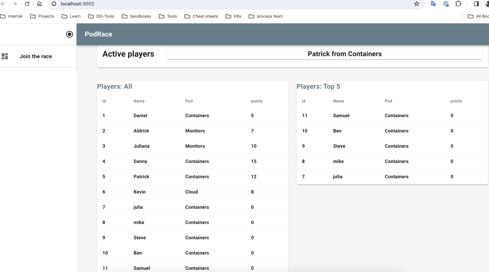
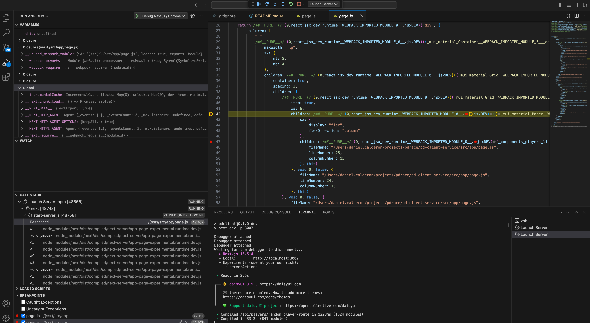

# PodRace Client Service

This is the service used to render in the browser PodRace app. The client uses Next.js 13 - App router (beta) 

https://nextjs.org/docs/getting-started/installation 

## About PodRace


Function that displays the information about creators and maintainers of the page  PodRace is a FullStack application created by some Datadog's TSEs to connect and test Datadog features in a real and fun environment.

The logic behind this is to create a weekly "Tse Pods Race" in which the Players (TSEs) will collect points to their Pods (Specs) with Events.

These Events are day to day actions with points associated to them, example:

- Receive a flare = 5 pts
- Finishing a call = 10 pts
- Collaborate = 10 pts
- Run a workshop = 50 pts
- Bring cookies to the team = 1 billions pts (Yes, It's for you Jas)


## Service structure

The application folders and files are located under **src/** 


In this readme the functions would be identified as below to explain where the function would be rendered: 

\* CC=Client Components: Functions that runs in  next.js client side (browser)

\* SC=Server Components: Functions that runs in the next.js server side

https://nextjs.org/learn/react-foundations/server-and-client-components 

### SRC Directory 

1. **src/app/layout.js (CC)** Provides a common framework to the application pages (childrens). Also includes the following components: 

* **ThemeProvider (CC)**: Define the styling template shared by the pages

 * **BarDrawer (CC)**: Navigation bar and side panel. Contain link for the page **/createplayer (CC)**

 * **Marquee (CC)**: Top marquee that renders the function **RandomPlayers** which fetch every 4 seconds a new player from the Users API service. 

 * **Copyright (CC)**: Function that displays the information about creators and maintainers of the page 

2. **src/app/main.js (CC)**: Application Home Page (/) and renders the different components: 
 * **ListPlayers (CC)**: Fetch and display all the players from the Users API service. 
 * **TopPlayers (CC)**: Fetch and display the top 5 players (points) from the Users API service. 
 * **ListPods (CC)**: Fetch and display all the Pods from the Users API service. 
 * **ListEvents (CC)**: Fetch and display all the Events from the Users API service.

3. **src/app/createplayer/page.js (CC)**: page that renders the function **addPlayers (CC)**
 which create a New Player through a POST request to the Users API service. 

4. **src/app/api (SC)**: Contain the routes.js used to make request from the server side. 

5. **src/components (CC)**: Users, Pods, Events functions directory. 

6. **src/lib (SC)**: auxiliar server components directory 

7. **src/styling (SC)**: Theme configuration directory 

## Getting started

### Setting the service

1. Clone repo: 

```
https://github.com/TSE-Coders/pd-client-service.git
```

2. Go to work directory 

```
cd pd-client-service
```

3. Install dependencies: 
```
npm install 
```

### Running the service: 

1. Confirm that the users-api-service is running. For more information follow this repo: https://github.com/TSE-Coders/pd-users-api 

2. Run the service: 

```
npm run dev 
```

### Debugging (VScode only):
()

If you are using VScode, the file **.vscode/launch.json** contains the debug console configuration. https://code.visualstudio.com/docs/editor/debugging 


## Dependencies: 


* Next.js: ```npm i next``` https://nextjs.org/docs/getting-started/installation

* Tailwind: ```npm install -D tailwindcss clsx tailwind-merge``` https://tailwindcss.com

* DaisyUI: ```npm i -D daisyui@latest``` 
https://daisyui.com

* Mui Material: ```npm install @mui/material @emotion/react @emotion/styled```, ```npm install @mui/icons-material``` 
https://mui.com/material-ui/getting-started/installation 

Docker image:

- Building image with processor flag
- https://docs.docker.com/build/building/multi-platform/#:~:text=When%20triggering%20a%20build%2C%20use,one%20platform%20at%20a%20time.

docker build --platform=linux/amd64 -t ccdaniele/pd-client-service:v1.0_linuxamd_dnsregis_port3002_axios .
Tag: 
  - version: v1.0 
  - Architecture: linuxamd
  - Endpoint: dnsregis (dns registry:pd-api-svc.default.svc.cluster.local)
  - Port Exposing: port3002
  - fetch: axios
  


  Axios: https://jelaniharris.com/blog/fixing-econnrefused-error-in-rails-and-nextjs-docker-containers/
